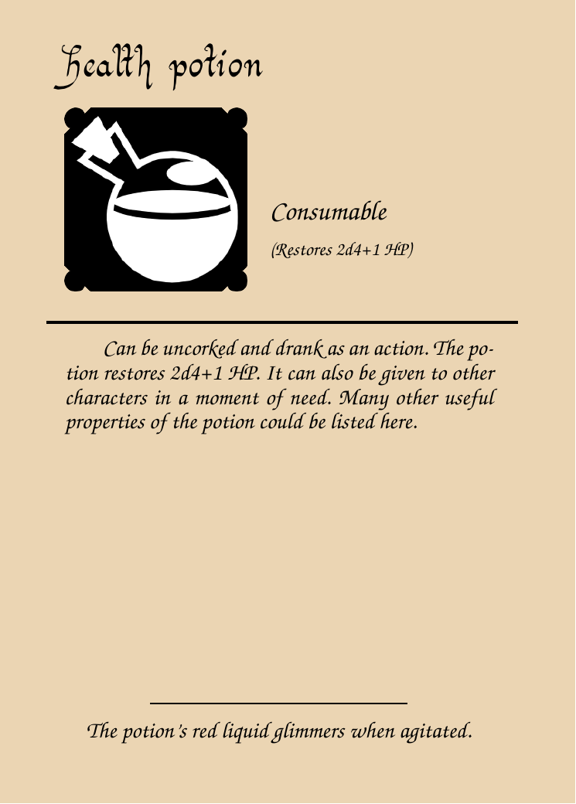

# dndCard.sh

Takes some fields from an input file and builds a pdf and image of a card from them.

## Usage

```
dndCard.sh [-t templateFile] [-b bodyFile] inputFile
```

## Example

Example of input file:

```
name#Health potion
typetext#Consumable
hint#(Restores 2d4+1 HP)
body#Can be uncorked and drank as an action. The potion restores 2d4+1 HP. It can also be given to other characters in a moment of need. Many other useful properties of the potion could be listed here.
flavor#The potion's red liquid glimmers when agitated.
icon#potion-ball.png
```

Note that the body field could be on another file provided with the `-b` option, but it still should
be just one line.

Example of output, with no image background and using
[an icon](https://game-icons.net/1x1/lorc/potion-ball.html) downloaded as-is from the amazing source
[game-icons.net](https://game-icons.net/):



## Additional notes

A background image can be provided; if not, the background will have a plain color. The template is
fully editable or others could be created, just bare in mind that the words between `@`, such as
`@name@` or `@icon@`, are what the script searches for to insert the text and image file names.
Don't leave commented lines since they are uncommented when no background image is found. Related to
this, the lines containing `%bg%` are deleted when no background image is found.
