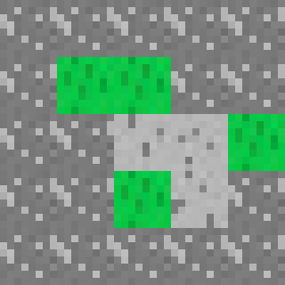
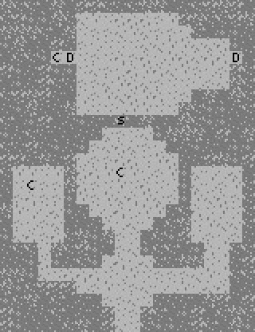
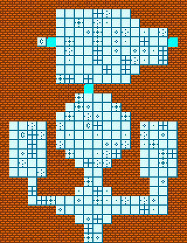

# mapGen.sh

A shellscript to make grid maps from text files.



```
xxxxx
xGGxx
xxooG
xxGox
xxxxx
```

## Dependencies

- A POSIX-compliant shell (`bash`, `dash`, `sh`, `zsh`)
- ImageMagick
- Tools expected in a Unix environment: `grep`, `sed`, `awk`

## Motivation

The want for Vim to be a map maker.

## Concept

Given a text file in which each character represents a cell, have a script draw that map.

`mapGen.sh` takes as input a text file with a block of text which ideally has a block of characters
with no missing ones. It also takes a folder in which tile images are supposed to be. For each
character in the file, it randomly takes one image in that folder which name starts with that
characters and creates an image from the text file.

## Examples





Both images obtained from the same input:

```
XXXXXXXXXXXXXXXXXXXX
XXXXXXooooooooXXXXXX
XXXXXXoooooooooXXXXX
XXXXXXooooooooooooXX
XXXXCDooooooooooooDX
XXXXXXooooooooooooXX
XXXXXXooooooooooooXX
XXXXXXoooooooooXXXXX
XXXXXXooooooooXXXXXX
XXXXXXXXXSXXXXXXXXXX
XXXXXXXXooooXXXXXXXX
XXXXXXXooooooXXXXXXX
XXXXXXooooooooXXXXXX
XooooXoooCooooXooooX
XoCooXooooooooXooooX
XooooXooooooooXooooX
XooooXXooooooXXooooX
XooooXXXooooXXXooooX
XooooXXXXooXXXXooooX
XXXoXXXXXooXXXXXooXX
XXXoXXXXooooXXXXooXX
XXXoooooooooooooooXX
XXXXXXooooooooooooXX
XXXXXXXXooooXXXXXXXX
XXXXXXXXXooXXXXXXXXX
XXXXXXXXXooXXXXXXXXX
```

## Usage

```
mapGen.sh [-s SIZE] [-f TILE_FOLDER] SOURCE_FILE
```

Where `SIZE` is the size of the tile images in pixels (default 8), `TILE_FOLDER` is the folder
where the tile images are stored (default `./tiles`) and `SOURCE_FILE` is the text file with the
layout of the map.

## Possibilities

The direct mapping of characters in text file to beginning of tile image name gives flexibility to
either choose characters easy to read on the file or to use characters directly taken from the
image names for easier memorization. Either way, the "configuration" of the relationship is
trivial and freely customizable.

For the examples I used tiles of 8x8 pixels, but other styles could be attained by using bigger
ones.
